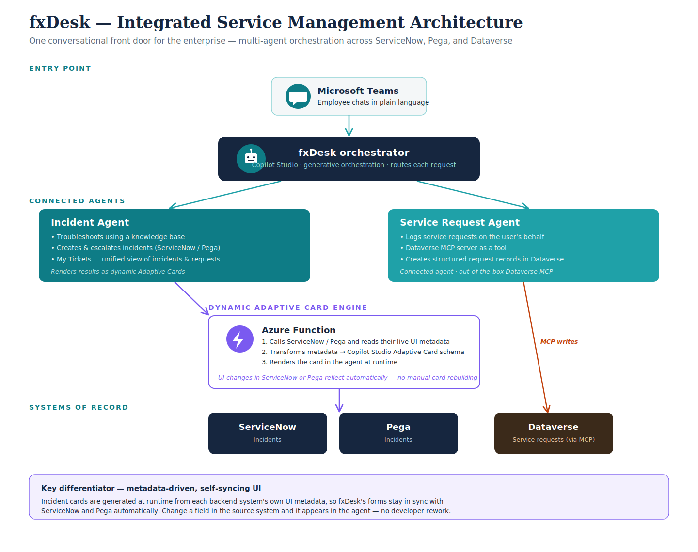

# fxDesk — Integrated, Enterprise-Wide Service Management Agent

An AI-powered, multi-agent assistant built in **Microsoft Copilot Studio** that gives an
entire enterprise a single conversational front door for service management. Employees
describe what they need in plain language; fxDesk routes each request to the right
specialist agent and handles it across multiple backend systems — **ServiceNow and Pega**.

Built for the **Microsoft Agent Academy Hackathon (Operative track)**.

---

## The Problem

Across an enterprise, service management is fragmented. IT, HR, and facilities each use
different systems and portals, and employees must know which tool and form to use for every
request or issue. It's slow, manual, and inconsistent — incidents live in one system,
service requests in another, with no single view and no unified way to ask for help.

**Target users:** any employee who needs to raise an issue, request something, or check the
status of their tickets — without needing to know which system or form to use.

---

## What It Does — Three Capabilities

### 1. Troubleshoot & raise an incident (multi-system)
The employee describes a problem. fxDesk troubleshoots from a knowledge base first, and
raises an incident when escalation is needed — routing it to the right backend:
- A WiFi connectivity issue → raised in **ServiceNow**
- A payslip-download issue → routed to **Pega**

One conversation, the correct system of record behind each issue.

### 2. Create a service request
The employee asks for software, access, or hardware. The Service Request Agent logs a
structured service request on their behalf using the **out-of-the-box Dataverse MCP server**
(added as a tool on the connected agent), which creates the request as a record in
**Dataverse** — no portal, no form.

### 3. View my tickets (unified)
The employee asks for status. fxDesk retrieves their incidents and service requests from
**both ServiceNow and Pega** and presents them in one unified view.

---

## What Makes It Different — Dynamic, Metadata-Driven Adaptive Cards

fxDesk's Adaptive Cards are **not hardcoded**. An **Azure Function** sits between the agent
and the backend systems:

1. It calls ServiceNow or Pega and reads that system's **live UI metadata** (its form and
   field definitions).
2. It **transforms that metadata into Copilot Studio Adaptive Card schema** at runtime.
3. The agent renders the resulting card.

**The payoff:** any UI change made in ServiceNow or Pega — a new field, an updated form — is
reflected in the agent's card **automatically**, with no manual card rebuilding and no
developer rework. The backend system stays the single source of truth, and the agent's UI
stays in sync with it on its own.

This applies to both the incident cards and the My Tickets view.

---

## Architecture

**Entry point:** an employee chats with fxDesk in Microsoft Teams.

**Orchestrator:** the fxDesk agent in Copilot Studio, using generative orchestration,
interprets each request and routes it to the right connected agent.

**Connected agents:**
- **Incident Agent** — troubleshoots from a knowledge base, creates and escalates incidents
  to ServiceNow/Pega, and powers the My Tickets unified view. Renders results as dynamic
  Adaptive Cards.
- **Service Request Agent** — creates structured service-request records in Dataverse using
  the out-of-the-box Dataverse MCP server, added as a tool on the connected agent.

**Dynamic Adaptive Card engine:** an Azure Function reads ServiceNow/Pega UI metadata and
transforms it into Adaptive Card schema at runtime.

**Backend systems of record:** ServiceNow and Pega (incidents and requests).

**Data flow:**
`Employee (Teams) → fxDesk orchestrator (Copilot Studio) → connected agent. Incidents go to
ServiceNow / Pega via the Incident Agent (with the Azure Function rendering dynamic Adaptive
Cards from backend UI metadata); service requests go to Dataverse via the Service Request
Agent using the Dataverse MCP server.`

---

## Tech Stack

- **Microsoft Copilot Studio** — orchestrator + connected agents, generative orchestration
- **Connected agents** — multi-agent design (Incident Agent, Service Request Agent)
- **Model Context Protocol (MCP)** — the out-of-the-box Dataverse MCP server, used by the Service Request Agent to create request records in Dataverse
- **Azure Functions** — metadata-driven dynamic Adaptive Card generation
- **ServiceNow** — incidents (system of record)
- **Pega** — incidents (system of record)
- **Microsoft Dataverse** — stores service requests (written via the Dataverse MCP server)
- **Microsoft Teams** — deployment channel
- **Adaptive Cards** — rich, interactive responses rendered dynamically

---

## Agent Academy Concepts Applied (Operative track)

- **Multi-agent orchestration** — a generative orchestrator routing to specialist connected agents
- **Connected agents** — Incident Agent and Service Request Agent as independent, composable agents
- **Model Context Protocol (MCP)** — the out-of-the-box Dataverse MCP server, added as a tool on the connected Service Request Agent, creates request records in Dataverse
- **Knowledge-grounded troubleshooting** — the Incident Agent answers from a knowledge base
- **External system integration** — incidents integrated with ServiceNow and Pega via connectors and an Azure Function; service requests persisted in Dataverse
- **Dynamic Adaptive Cards** — metadata-driven UI generated at runtime from ServiceNow/Pega
- **Publishing to Microsoft Teams**

*(Module names will be aligned to the exact Operative curriculum lessons.)*

---

## Repository Contents

| Path | Description |
|---|---|
| `solution/` | Exported Copilot Studio solution (.zip) — orchestrator, connected agents, and flows |
| `azure-function/` | The Azure Function that reads ServiceNow/Pega UI metadata and builds Adaptive Card schema (source and/or description) |
| `fxDesk_Architecture.png` | Solution architecture diagram |
| `docs/` | Demo deck (optional) |
| `screenshots/` | Screenshots of the agent in action (optional) |

---

## Setup / Import Notes

1. **Import the solution:** in the Power Platform maker portal (make.powerapps.com) →
   Solutions → Import solution → select the .zip in `solution/`.
2. **Deploy the Azure Function:** deploy the function in `azure-function/` to your Azure
   subscription; note its endpoint URL.
3. **Configure connections / variables:** after import, set the connection references and
   any environment variables — ServiceNow, Pega, the Azure Function endpoint, and the MCP
   connection (and Outlook if used). Reconnect/authenticate each connector.
4. **Set up the knowledge base** for the Incident Agent's troubleshooting.
5. **Publish** the agent to Microsoft Teams.

> Note: the Azure Function is a separate Azure resource and is not part of the Power
> Platform solution. It is provided here under `azure-function/` and must be deployed
> separately, with its endpoint configured in the agent's tool/connection.

---

## Demo

A walkthrough video (≤ 5 minutes) demonstrates all three capabilities — incident creation
across ServiceNow and Pega, a service request via MCP, and the unified My Tickets view —
plus a **live demonstration** of the dynamic Adaptive Card: a new field added to a Pega
process appears in the agent's card instantly, with no code change or redeployment.

*Demo video: [link]*
